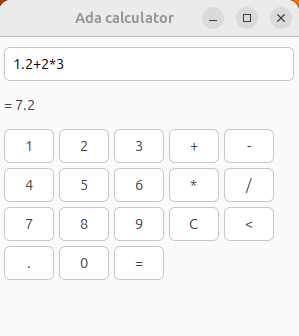

The purpose of this exercize was to study Ada and little bit of SPARK.
My interest in Ada was driven by the fact that this language was specifically designed for safety- and security-critical software.
The materials used to study Ada and SPARK were taken from AdaCore. I tried to touch upon topics of typing, accesses (pointers),
subprograms, packages, visibility, generics, object-oriented programming, concurrency and contracts.
